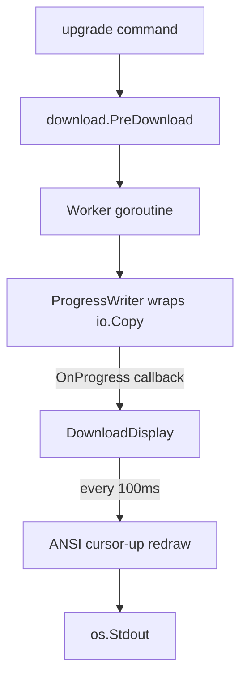

# Design: Multi-Line Download Progress Bars

## System Architecture

The feature adds a progress-tracking writer and a multi-line renderer to `internal/download/`. The existing `PreDownload` gains an `OnProgress` callback that fires during downloads. The upgrade command creates a `DownloadDisplay` that receives progress events and redraws N slot lines using ANSI cursor-up codes.



### New Components

| Component | Location | Purpose |
|-----------|----------|---------|
| ProgressWriter | `internal/download/progress.go` | `io.Writer` wrapper that tracks bytes and calls `OnProgress` |
| DownloadDisplay | `internal/download/progress.go` | Multi-line renderer with slot management and 100ms ticker |

### Design Decisions

1. **Single file addition** — All new logic in `internal/download/progress.go`. No new packages. Minimal surface area.

2. **`OnProgress` callback on Options** — Additive change to `Options` struct. `PreDownload` signature unchanged. Existing callers unaffected (nil callback = no-op).

3. **ProgressWriter wraps response body** — Replace `io.Copy(f, resp.Body)` with `io.Copy(f, io.TeeReader(resp.Body, &pw))` or use a custom writer. The writer calls `OnProgress` on each `Write` call.

4. **Slot-based display** — N slots (= concurrency). Each slot shows one active download. When a download finishes, the slot is freed for the next queued package. This matches docker pull UX.

5. **100ms ticker for redraw** — Don't redraw on every Write (too frequent). A goroutine ticks every 100ms and redraws all slots. Thread-safe via mutex on slot state.

6. **ANSI cursor-up** — Print N lines, then on each redraw: `\033[NA` moves cursor up N lines, then reprint all N lines. Simple, no termcap dependency.

7. **Non-TTY fallback** — If not a TTY, skip multi-line rendering. Print one line per completion via `OnComplete` (already exists).

---

## Technical Design

### Options Change

```go
// internal/download/download.go (addition to Options)
type Options struct {
    Concurrency int
    CacheDir    string
    OnComplete  func(Result)
    OnProgress  func(name string, downloaded, total int64) // NEW
}
```

### ProgressWriter

```go
// internal/download/progress.go

// ProgressWriter wraps writes and reports byte progress.
type ProgressWriter struct {
    Name       string
    Total      int64 // from Content-Length; 0 if unknown
    Downloaded int64
    OnProgress func(name string, downloaded, total int64)
}

func (pw *ProgressWriter) Write(p []byte) (int, error) {
    n := len(p)
    pw.Downloaded += int64(n)
    if pw.OnProgress != nil {
        pw.OnProgress(pw.Name, pw.Downloaded, pw.Total)
    }
    return n, nil
}
```

Usage in `downloadFile`: replace `io.Copy(f, resp.Body)` with:
```go
pw := &ProgressWriter{Name: name, Total: resp.ContentLength, OnProgress: opts.OnProgress}
n, err := io.Copy(f, io.TeeReader(resp.Body, pw))
```

### DownloadDisplay

```go
// internal/download/progress.go

type SlotState struct {
    Name       string
    Downloaded int64
    Total      int64
    Done       bool
    Err        error
}

type DownloadDisplay struct {
    mu       sync.Mutex
    slots    []SlotState
    isTTY    bool
    rendered bool // true after first render
}

func NewDownloadDisplay(concurrency int) *DownloadDisplay

// UpdateProgress updates a slot's byte counts (called from OnProgress).
func (d *DownloadDisplay) UpdateProgress(name string, downloaded, total int64)

// MarkDone marks a slot as complete (success or failure).
func (d *DownloadDisplay) MarkDone(name string, err error)

// AssignSlot assigns a package to a free slot.
func (d *DownloadDisplay) AssignSlot(name string, total int64)

// Start begins the 100ms render loop. Returns a stop function.
func (d *DownloadDisplay) Start() func()

// render redraws all slot lines using cursor-up.
func (d *DownloadDisplay) render()
```

### Render Logic

TTY mode:
1. First render: print N lines (one per slot)
2. Subsequent renders: print `\033[NA` (cursor up N), then reprint all N lines
3. Each line: `renderSlot(slot) string`

```go
func renderSlot(s SlotState) string {
    if s.Done && s.Err == nil {
        return fmt.Sprintf("  %s✓%s %s (%.1f MB)", Green, Reset, s.Name, float64(s.Total)/1e6)
    }
    if s.Done && s.Err != nil {
        return fmt.Sprintf("  %s✗%s %s: %v", Red, Reset, s.Name, s.Err)
    }
    if s.Name == "" {
        return "" // empty slot
    }
    if s.Total <= 0 {
        return fmt.Sprintf("  ↓ %s  %.1f MB", s.Name, float64(s.Downloaded)/1e6)
    }
    pct := int(s.Downloaded * 100 / s.Total)
    filled := pct * 20 / 100
    bar := strings.Repeat("█", filled) + strings.Repeat("░", 20-filled)
    return fmt.Sprintf("  ↓ %s  %s %3d%% (%.1f/%.1f MB)",
        s.Name, bar, pct, float64(s.Downloaded)/1e6, float64(s.Total)/1e6)
}
```

Non-TTY mode: `DownloadDisplay` does nothing on progress updates. The existing `OnComplete` callback in the upgrade command prints one line per completion.

### Integration with Upgrade Command

Replace the current `OnComplete`-based counter with `DownloadDisplay`:

```go
if len(urls) > 0 {
    dd := download.NewDownloadDisplay(dlConcurrency)
    stop := dd.Start()

    results := download.PreDownload(urls, download.Options{
        Concurrency: dlConcurrency,
        CacheDir:    cacheDir,
        OnProgress: func(name string, downloaded, total int64) {
            dd.UpdateProgress(name, downloaded, total)
        },
        OnComplete: func(res download.Result) {
            dd.MarkDone(res.Package.Name, res.Err)
        },
    })

    stop()
    // Print warnings for failures
}
```

### downloadFile Signature Change

`downloadFile` needs access to `OnProgress` and the package name. Change internal signature:

```go
func downloadFile(client *http.Client, url, dest, name string, onProgress func(string, int64, int64)) (int64, error)
```

The goroutine in `PreDownload` passes `opts.OnProgress` and `p.Name` through.

---

## Implementation Phases

### Phase 1: ProgressWriter & downloadFile integration (~1h)

- Add `OnProgress` to `Options`
- Create `ProgressWriter` in `internal/download/progress.go`
- Update `downloadFile` to use `ProgressWriter` via `io.TeeReader`
- Unit tests for ProgressWriter byte tracking

**Deliverable:** `OnProgress` fires during downloads with correct byte counts.

### Phase 2: DownloadDisplay renderer (~1.5h)

- Implement `DownloadDisplay` with slot management
- Implement `renderSlot` with bar/no-bar/done states
- Implement 100ms ticker with cursor-up redraw
- TTY/non-TTY detection
- Unit tests for render output (all states)

**Deliverable:** Multi-line display renders correctly.

### Phase 3: Integration & polish (~1h)

- Wire `DownloadDisplay` into upgrade command
- Remove old single-line counter
- Integration tests
- Verify non-TTY fallback
- Verify existing tests pass

**Deliverable:** `syncd upgrade` shows per-file progress bars.

---

## Testing Strategy

### Unit Tests

| Test | Validates |
|------|-----------|
| ProgressWriter tracks bytes correctly | REQ-164 |
| ProgressWriter reports Content-Length | REQ-165 |
| renderSlot with known total shows bar + percentage | REQ-158, REQ-174 |
| renderSlot with unknown total shows bytes only | REQ-166 |
| renderSlot done+success shows ✓ | REQ-161 |
| renderSlot done+error shows ✗ | REQ-162 |
| Bar at 50% = 10█ + 10░ | REQ-174 |
| Slot assignment and transition | REQ-161 |

### Integration Tests

| Test | Validates |
|------|-----------|
| Download with progress — output contains cursor-up codes | REQ-159 |
| Non-TTY — no cursor codes, one line per completion | REQ-167, REQ-168 |
| Existing download tests pass unchanged | REQ-172 |
| Verbose mode skips pre-download | REQ-173 |

---

## Requirement-to-Design Mapping

| Requirement | Design Section |
|-------------|---------------|
| REQ-157 | DownloadDisplay — slot-based display |
| REQ-158 | Render Logic — `renderSlot` format |
| REQ-159 | Render Logic — cursor-up codes |
| REQ-160 | DownloadDisplay — 100ms ticker |
| REQ-161 | DownloadDisplay — `MarkDone` + slot transition |
| REQ-162 | DownloadDisplay — `MarkDone` with error |
| REQ-163 | Render Logic — final state persists |
| REQ-164 | ProgressWriter — byte tracking |
| REQ-165 | ProgressWriter — `resp.ContentLength` |
| REQ-166 | Render Logic — unknown total branch |
| REQ-167 | DownloadDisplay — non-TTY skip |
| REQ-168 | Integration — OnComplete prints name + size |
| REQ-169 | Options Change — `OnProgress` field |
| REQ-170 | ProgressWriter — calls OnProgress |
| REQ-171 | Technical — file location |
| REQ-172 | Integration — OnComplete unchanged |
| REQ-173 | Integration — verbose bypass |
| REQ-174 | Render Logic — 20-char bar with █/░ |
| REQ-175 | DownloadDisplay — `golang.org/x/term` |
| REQ-176 | Render Logic — `cli.Green`, `cli.Red` |
