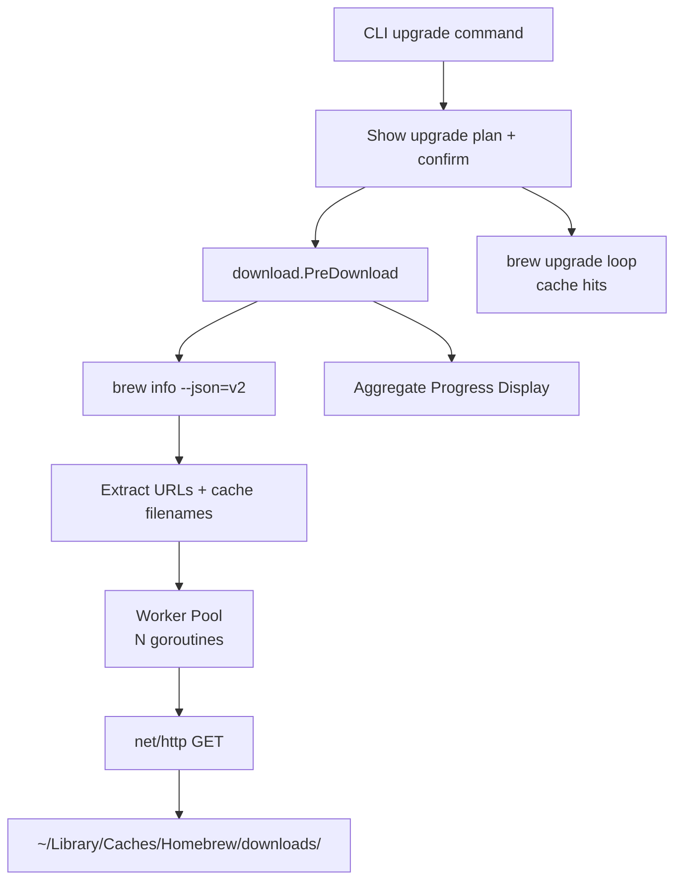

# Design: Parallel Pre-Download for syncd Upgrade

## System Architecture

Parallel pre-download adds a new `internal/download` package that runs between upgrade confirmation and the `brew upgrade` loop. It queries `brew info --json=v2` for URLs, downloads in parallel to brew's cache, then the existing upgrade loop gets cache hits.



### New Components

| Component | Location | Purpose |
|-----------|----------|---------|
| URL Extractor | `internal/download/info.go` | Parse `brew info --json=v2` JSON for bottle/cask URLs |
| Cache Namer | `internal/download/cache.go` | Generate SHA256-prefixed cache filenames |
| Downloader | `internal/download/download.go` | Parallel HTTP download with worker pool |
| Platform | `internal/download/platform.go` | Detect macOS arch + version for bottle selection |

### Design Decisions

1. **New `internal/download` package** — Keeps download logic separate from progress, runner, and CLI. Uses `CommandRunner` from `internal/runner` for `brew info` queries.

2. **Worker pool with semaphore** — Use a buffered channel as semaphore to limit concurrency. Simple, no external deps. Each download is a goroutine gated by the semaphore.

3. **Atomic file placement** — Download to `filename.downloading`, rename on success, delete on failure. Prevents brew from reading partial files.

4. **Non-fatal failures** — All download errors are warnings. The upgrade loop runs regardless. Brew handles its own downloads for any cache misses.

5. **Skip verbose mode** — When `--verbose` is set, skip pre-download entirely. Verbose users want to see brew's native output including its own download progress.

6. **Reuse existing `progress.Display`** — Use the same `\r` overwrite display for aggregate progress. No new display infrastructure needed.

7. **Single `brew info` call** — Query all outdated packages in one `brew info --json=v2 pkg1 pkg2 ...` call rather than per-package. Minimizes subprocess overhead.

---

## Technical Design

### URL Extraction

```go
// internal/download/info.go
package download

import "github.com/joedorseyjr/syncd/internal/runner"

// PackageURL holds the download URL and cache filename info for one package.
type PackageURL struct {
    Name     string
    Version  string
    URL      string
    Filename string // final cache filename (SHA256--name--version.ext)
    IsCask   bool
}

// GetFormulaURLs queries brew info --json=v2 for formula bottle URLs.
func GetFormulaURLs(r runner.CommandRunner, names []string) ([]PackageURL, error)

// GetCaskURLs queries brew info --json=v2 --cask for cask download URLs.
func GetCaskURLs(r runner.CommandRunner, names []string) ([]PackageURL, error)
```

Formula JSON structure (relevant fields):
```json
{
  "formulae": [{
    "name": "neovim",
    "versions": { "stable": "0.10.0" },
    "bottle": {
      "stable": {
        "files": {
          "arm64_sonoma": { "url": "https://ghcr.io/..." },
          "sonoma": { "url": "https://ghcr.io/..." },
          "all": { "url": "https://ghcr.io/..." }
        }
      }
    }
  }]
}
```

Cask JSON structure:
```json
{
  "casks": [{
    "token": "firefox",
    "version": "126.0",
    "url": "https://download-installer.cdn.mozilla.net/..."
  }]
}
```

### Platform Detection

```go
// internal/download/platform.go
package download

// Platform returns the brew platform string (e.g., "arm64_sonoma", "sonoma").
func Platform() string
```

Implementation:
1. `runtime.GOARCH` → `arm64` or `amd64` (mapped to empty prefix for Intel)
2. `sw_vers -productVersion` → extract major version → map to macOS codename
3. Combine: `arm64_sonoma`, `sonoma`, etc.

macOS version → codename mapping:
| Version | Codename |
|---------|----------|
| 15.x | sequoia |
| 14.x | sonoma |
| 13.x | ventura |
| 12.x | monterey |

### Cache Filename Generation

```go
// internal/download/cache.go
package download

// CacheFilename generates brew's cache filename for a given URL, name, and version.
// Format: SHA256(url)--name--version.bottle.tar.gz (formulae)
// Format: SHA256(url)--name--version.ext (casks)
func CacheFilename(url, name, version string, isCask bool) string

// CacheDir returns brew's download cache directory.
func CacheDir() string  // ~/Library/Caches/Homebrew/downloads/
```

The SHA256 is computed over the URL string (not the file contents). Output is lowercase hex.

### Parallel Downloader

```go
// internal/download/download.go
package download

import "github.com/joedorseyjr/syncd/internal/progress"

// Result holds the outcome of a single download attempt.
type Result struct {
    Package  string
    Err      error
    Bytes    int64
    Cached   bool // true if file already existed
}

// Options configures the parallel download.
type Options struct {
    Concurrency int
    Display     *progress.Display
    Verbose     bool
}

// PreDownload downloads all packages in parallel to brew's cache.
// Returns results for each package. Errors are non-fatal.
func PreDownload(packages []PackageURL, opts Options) []Result
```

Implementation flow:
1. Create semaphore channel (buffered, size = concurrency)
2. For each package:
   a. Check if final file exists in cache → skip (Result.Cached = true)
   b. Acquire semaphore slot
   c. Launch goroutine: HTTP GET → write to `filename.downloading` → rename to final
   d. On error: delete `.downloading` file, set Result.Err
   e. Release semaphore slot
3. Wait for all goroutines (sync.WaitGroup)
4. Update aggregate progress after each completion

### Progress Display

Reuse `progress.Display` for aggregate progress:

```go
// During download phase:
display.Status("  Downloading [%d/%d] %.1f MB", completed, total, totalBytes/1e6)

// On completion:
display.Finish("  Downloaded %d/%d packages (%.1f MB)", succeeded, total, totalBytes/1e6)
```

In verbose mode, print per-package messages:
```
  ↓ neovim (12.3 MB)
  ✓ neovim downloaded
  ↓ firefox (98.1 MB)
  ✗ firefox: connection timeout
```

### Integration with Upgrade Command

The upgrade command changes minimally. After confirmation, before the upgrade loop:

```go
// After confirmation, before upgrade loop:
if !runner.Verbose {
    urls := download.GetFormulaURLs(r, brewNames)
    caskURLs := download.GetCaskURLs(r, caskNames)
    allURLs := append(urls, caskURLs...)
    
    if len(allURLs) > 0 {
        results := download.PreDownload(allURLs, download.Options{
            Concurrency: concurrency,
            Display:     display,
        })
        // Print summary, warnings for failures
    }
}
// Existing upgrade loop unchanged
```

The `--concurrency` flag is added to the upgrade command:

```go
cmd.Flags().IntVar(&concurrency, "concurrency", 4, "parallel download workers")
```

---

## Implementation Phases

### Phase 1: URL Extraction & Cache Naming (~2h)

- Create `internal/download/` package
- Implement `Platform()` with arch + version detection
- Implement `GetFormulaURLs()` — parse `brew info --json=v2` JSON
- Implement `GetCaskURLs()` — parse cask JSON
- Implement `CacheFilename()` and `CacheDir()`
- Unit tests for JSON parsing, platform detection, filename generation

**Deliverable:** Can extract URLs and generate correct cache filenames.

### Phase 2: Parallel Downloader (~2h)

- Implement `PreDownload()` with worker pool
- HTTP GET with redirect following
- `.downloading` suffix + atomic rename
- Cleanup on failure
- Skip already-cached files
- Unit tests with HTTP test server

**Deliverable:** Can download files in parallel to brew's cache.

### Phase 3: Progress & Integration (~1.5h)

- Add aggregate progress display during download phase
- Add `--concurrency` flag to upgrade command
- Wire `PreDownload` into upgrade flow (after confirm, before loop)
- Skip when verbose
- Print warnings for failed downloads
- Integration tests with fake brew

**Deliverable:** `syncd upgrade` pre-downloads in parallel with progress.

---

## Testing Strategy

### Unit Tests

| Package | Tests |
|---------|-------|
| `download` | Parse formula JSON — extract bottle URL for current platform |
| `download` | Parse formula JSON — fall back to `all` when platform missing |
| `download` | Parse cask JSON — extract URL and extension |
| `download` | Platform detection — mock arch/version |
| `download` | Cache filename — SHA256 prefix correct |
| `download` | Cache filename — cask preserves extension |
| `download` | Skip already-cached file |
| `download` | Atomic rename on success |
| `download` | Cleanup `.downloading` on failure |
| `download` | Concurrency limit respected |
| `download` | HTTP redirect followed |

### Integration Tests

| Scenario | Validates |
|----------|-----------|
| Upgrade with pre-download — cache files created | REQ-136, REQ-148 |
| Download failure — upgrade still succeeds | REQ-142, REQ-143 |
| `--concurrency 2` limits workers | REQ-138 |
| `--verbose` skips pre-download | REQ-150 |
| Already-cached files skipped | REQ-139 |
| Existing tests unchanged | REQ-156 |

---

## Requirement-to-Design Mapping

| Requirement | Design Section |
|-------------|---------------|
| REQ-128 | URL Extraction — `GetFormulaURLs` |
| REQ-129 | URL Extraction — platform selection from `bottle.stable.files` |
| REQ-130 | URL Extraction — `all` fallback |
| REQ-131 | URL Extraction — `GetCaskURLs` |
| REQ-132 | Platform Detection — `Platform()` |
| REQ-133 | Cache Filename Generation — `CacheFilename` (formula) |
| REQ-134 | Cache Filename Generation — SHA256 of URL |
| REQ-135 | Cache Filename Generation — `CacheFilename` (cask) |
| REQ-136 | Cache Filename Generation — `CacheDir()` |
| REQ-137 | Parallel Downloader — worker pool with semaphore |
| REQ-138 | Integration — `--concurrency` flag |
| REQ-139 | Parallel Downloader — skip existing files |
| REQ-140 | Parallel Downloader — `.downloading` suffix + rename |
| REQ-141 | Parallel Downloader — delete on failure |
| REQ-142 | Design Decision 4 — non-fatal failures |
| REQ-143 | Design Decision 4 — warnings not errors |
| REQ-144 | Progress Display — aggregate status line |
| REQ-145 | Progress Display — `\r` overwrite via `progress.Display` |
| REQ-146 | Progress Display — non-TTY fallback (inherited from Display) |
| REQ-147 | Progress Display — verbose per-package messages |
| REQ-148 | Integration — after confirm, before loop |
| REQ-149 | Design Decision 3 — atomic placement = cache hit |
| REQ-150 | Design Decision 5 — skip in verbose mode |
| REQ-151 | Integration — default concurrency 4 |
| REQ-152 | Design Decision 1 — `internal/download/` package |
| REQ-153 | URL Extraction — uses `CommandRunner` |
| REQ-154 | Parallel Downloader — `net/http` only |
| REQ-155 | Parallel Downloader — Go http.Client follows redirects by default |
| REQ-156 | Testing Strategy — existing tests pass |
