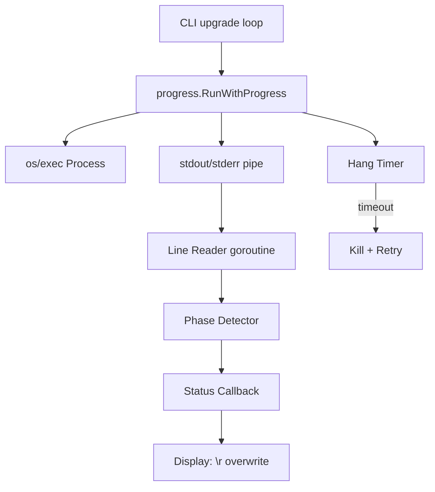

# Design: Smart Progress Display for Brew Upgrades

## System Architecture

Smart progress adds a new `internal/progress` package that sits between the CLI upgrade loop and the OS process. It captures output, detects phases, handles timeouts, and reports status via callback.



### New Components

| Component | Location | Purpose |
|-----------|----------|---------|
| Progress Runner | `internal/progress/runner.go` | Execute command with output capture, hang detection, retry |
| Phase Detector | `internal/progress/phase.go` | Parse brew output lines into phase names |
| Error Extractor | `internal/progress/errors.go` | Extract relevant error lines from captured output |
| Display | `internal/progress/display.go` | TTY-aware `\r` progress rendering |

### Design Decisions

1. **New `internal/progress` package** — Keeps progress logic separate from runner and CLI. The `CommandRunner` interface is unchanged (REQ-123). The upgrade command calls `progress` directly instead of `RunMutate`.

2. **Callback-based phase reporting** — `RunWithProgress` accepts a `func(phase string)` callback. This decouples detection from display, making unit testing trivial (REQ-126).

3. **Pipe capture, not PTY** — Use `cmd.StdoutPipe()` + `cmd.StderrPipe()` merged via `io.MultiReader`. Simpler than PTY allocation, sufficient for line-based parsing (REQ-118).

4. **Goroutine line reader with timer reset** — A goroutine reads lines and resets a timer on each line. If the timer fires (60s), the process is killed (REQ-114, REQ-119).

5. **Single retry on hang** — After kill, retry once with the same command. If it hangs again, report failure (REQ-115, REQ-116). No exponential backoff.

6. **TTY detection for display mode** — If stdout is a TTY, use `\r` overwrite. Otherwise, print one line per phase change (REQ-122).

7. **Verbose bypasses entirely** — When `runner.Verbose` is true, the upgrade loop uses `RunMutate` as before. Smart progress is not invoked (REQ-121).

---

## Technical Design

### Progress Runner

```go
// internal/progress/runner.go
package progress

import (
    "context"
    "os/exec"
    "time"
)

const HangTimeout = 60 * time.Second

// Result holds the outcome of a progress-tracked command.
type Result struct {
    Output []byte // full captured output
    Err    error
    Hung   bool   // true if killed due to timeout
}

// RunWithProgress executes a command, captures output line-by-line,
// calls onPhase for each detected phase, and kills on hang.
// Retries once if the process is killed due to timeout.
func RunWithProgress(name string, args []string, onPhase func(string)) Result
```

Implementation flow:
1. Create `exec.Command`, set env with `HOMEBREW_NO_AUTO_UPDATE=1`
2. Get `StdoutPipe()` and `StderrPipe()`, merge into one reader
3. Start command
4. Spawn goroutine: scan lines, detect phase, call `onPhase`, reset timer, append to buffer
5. Main: wait on either command completion or timer expiry
6. If timer fires: kill process, set `Hung = true`, retry once
7. If retry also hangs/fails: return failure result
8. On success: return result with captured output

### Phase Detector

```go
// internal/progress/phase.go
package progress

// DetectPhase examines a brew output line and returns a phase name.
// Returns "" if the line doesn't indicate a phase change.
func DetectPhase(line string) string
```

Phase detection rules (checked in order):
| Pattern | Phase |
|---------|-------|
| Contains `Downloading` or `downloading` | `"downloading"` |
| Contains `Pouring` or `pouring` | `"pouring"` |
| Contains `Installing` or `installing` | `"installing"` |
| Contains `Built` or `built from source` | `"built"` |

Returns `""` for lines that don't match — no phase change reported.

### Error Extractor

```go
// internal/progress/errors.go
package progress

// ExtractError returns relevant error lines from captured brew output.
// Looks for "Error:" lines and surrounding context.
func ExtractError(output []byte) string
```

Extraction logic:
1. Scan lines for `Error:` prefix (case-insensitive)
2. Include the error line and up to 2 following lines of context
3. If no `Error:` found, return last 3 lines of output as fallback
4. Trim to max 5 lines total

### Display

```go
// internal/progress/display.go
package progress

import "os"

// Display handles progress rendering.
type Display struct {
    IsTTY bool
    last  int // length of last line (for padding)
}

// NewDisplay creates a display, detecting TTY status.
func NewDisplay() *Display

// Status prints a progress status line. In TTY mode, overwrites previous.
func (d *Display) Status(format string, args ...interface{})

// Finish prints a final line that won't be overwritten (newline terminated).
func (d *Display) Finish(format string, args ...interface{})
```

TTY mode: `fmt.Fprintf(os.Stdout, "\r" + padded_line)`
Non-TTY mode: `fmt.Fprintf(os.Stdout, line + "\n")` only on phase change

### Integration with Upgrade Command

The upgrade loop in `internal/cli/upgrade.go` changes from:

```go
_, err := r.RunMutate("brew", "upgrade", name)
```

To:

```go
if runner.Verbose {
    _, err = r.RunMutate("brew", "upgrade", name)
} else {
    result := progress.RunWithProgress("brew", []string{"upgrade", name}, func(phase string) {
        display.Status("  [%d/%d] %s: %s", i+1, total, name, phase)
    })
    err = result.Err
    if err != nil {
        errMsg = progress.ExtractError(result.Output)
    }
}
```

On success: `display.Finish("  %s✓%s %s", Green, Reset, name)`
On failure: `display.Finish("  %s✗%s %s: %s", Red, Reset, name, errMsg)`

---

## Implementation Phases

### Phase 1: Progress Runner & Phase Detection (~2h)

- Create `internal/progress/` package
- Implement `RunWithProgress` with pipe capture, line reading, timer
- Implement `DetectPhase` with pattern matching
- Unit tests for phase detection (all patterns)
- Unit tests for hang detection (mock slow process)

**Deliverable:** Core engine that captures output and detects phases.

### Phase 2: Error Extraction & Display (~1.5h)

- Implement `ExtractError` with line scanning
- Implement `Display` with TTY detection and `\r` rendering
- Unit tests for error extraction (various brew failure outputs)
- Unit tests for display (TTY vs non-TTY output)

**Deliverable:** Clean error messages and progress rendering.

### Phase 3: Upgrade Integration (~1.5h)

- Update `internal/cli/upgrade.go` to use `progress.RunWithProgress`
- Verbose mode bypass (use `RunMutate` when verbose)
- Wire display into upgrade loop
- Integration tests with fake brew that outputs known patterns
- Verify existing tests still pass

**Deliverable:** `syncd upgrade` uses smart progress by default.

---

## Testing Strategy

### Unit Tests

| Package | Tests |
|---------|-------|
| `progress` | Phase detection for all patterns, empty lines, unknown lines |
| `progress` | Error extraction: `Error:` present, absent, multi-line |
| `progress` | Hang detection: process killed after timeout |
| `progress` | Retry: first hangs, second succeeds |
| `progress` | Retry: both hang, failure reported |
| `progress` | Display: TTY mode uses `\r`, non-TTY uses `\n` |

### Integration Tests

| Scenario | Validates |
|----------|-----------|
| Upgrade with fake brew that outputs phases | REQ-108, REQ-109, REQ-110 |
| Upgrade success shows `✓` | REQ-111 |
| Upgrade failure shows `✗` + error summary | REQ-112, REQ-113 |
| Verbose mode streams raw output | REQ-121 |
| Existing integration tests unchanged | REQ-124 |

### Test Helpers

Extend fake brew script to support:
- `upgrade` subcommand that prints phase-like output lines
- Configurable hang (sleep forever) via env var
- Configurable failure with `Error:` output

---

## Requirement-to-Design Mapping

| Requirement | Design Section |
|-------------|---------------|
| REQ-108 | Display — `\r` overwrite |
| REQ-109 | Integration — status format |
| REQ-110 | Phase Detector — pattern table |
| REQ-111 | Integration — `display.Finish` on success |
| REQ-112 | Integration — `display.Finish` on failure |
| REQ-113 | Error Extractor — `ExtractError` |
| REQ-114 | Progress Runner — timer kill |
| REQ-115 | Progress Runner — single retry |
| REQ-116 | Progress Runner — retry failure |
| REQ-117 | Progress Runner — `HangTimeout` constant |
| REQ-118 | Progress Runner — pipe capture |
| REQ-119 | Progress Runner — goroutine reader |
| REQ-120 | Progress Runner — output buffer |
| REQ-121 | Design Decision 7 — verbose bypass |
| REQ-122 | Display — TTY detection |
| REQ-123 | Design Decision 1 — interface unchanged |
| REQ-124 | Testing Strategy — existing tests pass |
| REQ-125 | New Components — `internal/progress/` |
| REQ-126 | Design Decision 2 — callback |
| REQ-127 | Display — `\r` + padding |
