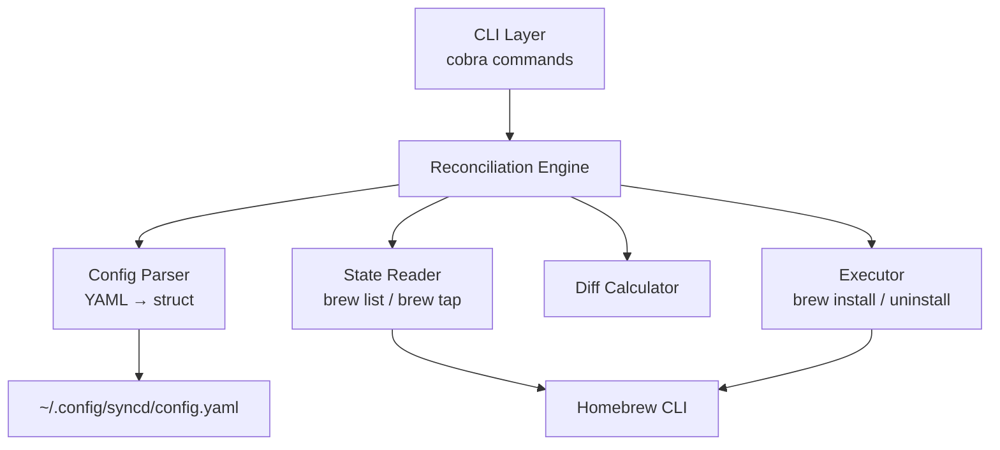
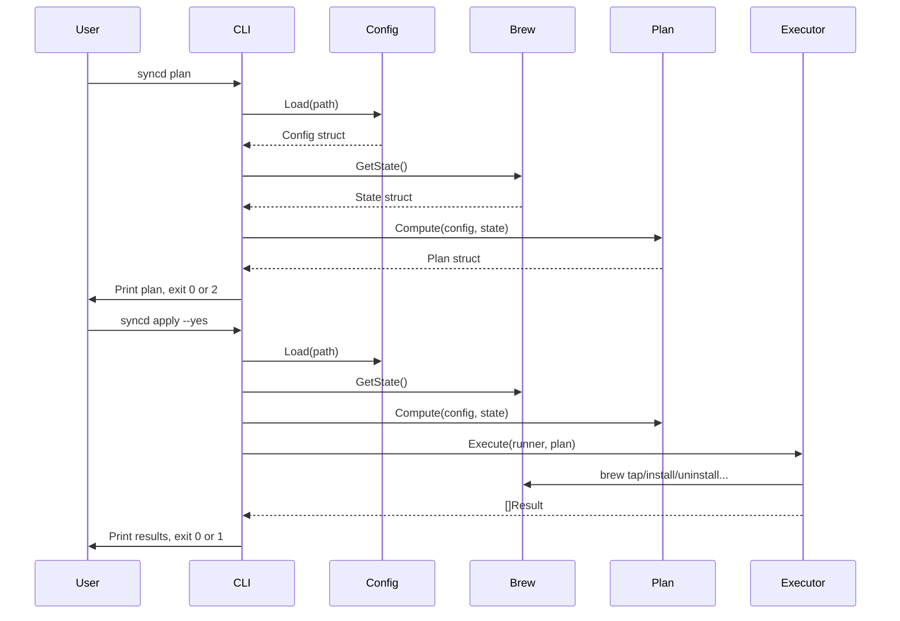

# Design: syncd v0.1 — MVP

## System Architecture

syncd follows a **desired-state reconciliation** pattern: read a declared config, query actual system state, compute a diff, and optionally apply changes. The architecture is a simple pipeline with no daemon, no database, and no network calls beyond what Homebrew itself makes.



### Component Responsibilities

| Component | Role |
|-----------|------|
| CLI Layer | Parse flags, route to commands, handle exit codes |
| Config Parser | Load and validate YAML into typed Go structs |
| State Reader | Query installed taps/brews/casks via `brew` CLI |
| Diff Calculator | Compare desired vs actual, produce a change plan |
| Executor | Run `brew` commands to reconcile state |

### Design Decisions

1. **Shell-out to Homebrew** — No Ruby API binding. Homebrew's CLI is the stable interface; shelling out keeps syncd decoupled from Homebrew internals. Supports REQ-027.

2. **Single binary, no daemon** — Users run syncd on-demand or via launchd (future). No background process to manage. Supports REQ-025, REQ-026.

3. **Plan/Apply separation** — Borrowed from Terraform. `plan` is read-only (REQ-010), `apply` mutates. This gives users confidence before changes happen (US-002).

4. **Continue on error** — A single package failure doesn't abort the run. Errors are collected and reported at the end (REQ-023, REQ-024).

---

## Technical Design

### Project Layout

```
syncd/
├── cmd/syncd/
│   └── main.go              # Entry point, cobra root command
├── internal/
│   ├── config/
│   │   ├── config.go        # Config struct + Load()
│   │   └── config_test.go
│   ├── brew/
│   │   ├── state.go         # Query installed taps/brews/casks
│   │   ├── executor.go      # Install/uninstall operations
│   │   └── brew_test.go
│   ├── plan/
│   │   ├── plan.go          # Diff logic, Plan struct
│   │   └── plan_test.go
│   └── cli/
│       ├── plan.go           # `syncd plan` command
│       └── apply.go          # `syncd apply` command
├── go.mod
├── go.sum
└── Makefile
```

### Core Types

```go
// internal/config/config.go
type Config struct {
    Taps    []string `yaml:"taps"`
    Brews   []string `yaml:"brews"`
    Casks   []string `yaml:"casks"`
    Cleanup Cleanup  `yaml:"cleanup"`
}

type Cleanup struct {
    RemoveUnlisted bool `yaml:"remove_unlisted"`
    ClearCache     bool `yaml:"clear_cache"`
    Autoremove     bool `yaml:"autoremove"`
}
```

```go
// internal/plan/plan.go
type Plan struct {
    TapsToAdd      []string
    TapsToRemove   []string
    BrewsToInstall []string
    BrewsToRemove  []string
    CasksToInstall []string
    CasksToRemove  []string
    Autoremove     bool
    ClearCache     bool
}

func (p *Plan) IsEmpty() bool
```

```go
// internal/brew/state.go
type State struct {
    Taps  []string
    Brews []string
    Casks []string
}

func GetState(runner CommandRunner) (*State, error)
```

```go
// internal/brew/executor.go
type Result struct {
    Action  string // "install", "uninstall", "tap"
    Package string
    Err     error
}

func Execute(runner CommandRunner, plan *plan.Plan) ([]Result, error)
```

### Command Flow



### Homebrew Interaction

All Homebrew interaction goes through `internal/brew/` using `os/exec`:

| Operation | Command |
|-----------|---------|
| List taps | `brew tap` |
| List brews | `brew list --formula -1` |
| List casks | `brew list --cask -1` |
| Add tap | `brew tap <name>` |
| Install brew | `brew install <name>` |
| Install cask | `brew install --cask <name>` |
| Remove brew | `brew uninstall <name>` |
| Remove cask | `brew uninstall --cask <name>` |
| Remove tap | `brew untap <name>` |
| Autoremove | `brew autoremove` |
| Clear cache | `brew cleanup` |

Commands are executed in this order: tap adds → brew installs → cask installs → tap removals → brew removals → cask removals → autoremove → cleanup cache. Each failure is captured in a `Result` and execution continues (REQ-023).

### Exit Codes

| Code | Meaning |
|------|---------|
| 0 | Success / no changes needed |
| 1 | Execution error (one or more operations failed) |
| 2 | Plan has pending changes (plan command only) |

### Config Resolution

Default path: `~/.config/syncd/config.yaml`

Override: `--config <path>` persistent flag on root command (REQ-032).

Validation on load:
- Homebrew must be installed — check `brew --version`; if missing, exit 1 with error message and install URL (`https://brew.sh`)
- File must exist (REQ-002 → exit 1 with message)
- File must be valid YAML (REQ-003 → exit 1 with parse error)
- Missing sections treated as empty slices (not an error)

---

## Implementation Phases

### Phase 1: Scaffolding & Config (REQ-001–004, REQ-025, REQ-028, REQ-029)

- Initialize Go module, set up cobra CLI skeleton
- Implement `config.Load()` with error handling
- Unit tests for valid config, missing file, invalid YAML

**Deliverable:** `syncd` binary that loads config and prints parsed output.

### Phase 2: State Reader (REQ-027)

- Implement `brew.GetState()` — parse output of `brew tap`, `brew list`
- Unit tests with mocked command output

**Deliverable:** Can query and display current system state.

### Phase 3: Plan Command (REQ-005–011)

- Implement `plan.Compute(config, state)` — set difference logic
- Implement `syncd plan` command with formatted output
- Exit code 0 vs 2 based on plan emptiness

**Deliverable:** `syncd plan` shows what would change without modifying anything.

### Phase 4: Apply Command (REQ-012–022)

- Implement `brew.Execute()` — run brew commands per plan
- Confirmation prompt (default) and `--yes` flag
- Cleanup operations (autoremove, clear cache)
- Error collection and reporting (REQ-023, REQ-024)

**Deliverable:** `syncd apply` reconciles system state to match config.

### Phase 5: Polish & Integration Testing

- End-to-end tests on a real system
- Makefile with `build`, `test`, `lint` targets
- Verify idempotency (REQ-022)

**Deliverable:** Stable, tested v0.1 binary.

---

## Testing & Validation Strategy

### Unit Tests

| Package | What's Tested | Approach |
|---------|---------------|----------|
| `config` | Parse valid YAML, missing file, invalid YAML, empty sections | Table-driven tests with fixture files |
| `plan` | Diff logic — adds, removes, no-ops, cleanup flags | Pure functions, no I/O |
| `brew` | Command output parsing | Mock `exec.Command` via interface |

### Integration Tests

| Scenario | Method |
|----------|--------|
| `plan` is read-only | Run plan, compare `brew list` before/after |
| `apply` installs packages | Declare a known-safe package, apply, verify installed |
| `apply` removes packages | Install a test package not in config, apply, verify removed |
| Idempotency | Apply twice, second plan shows no changes |
| Error handling | Declare nonexistent package, verify partial success + error report |

### Test Infrastructure

- **Unit tests:** `go test ./...` — no external dependencies
- **Integration tests:** Build tag `//go:build integration` — require Homebrew, run in CI or manually
- **Mocking strategy:** Define a `CommandRunner` interface for `brew/` package; unit tests inject a mock, production uses real `os/exec`

```go
// internal/brew/runner.go
type CommandRunner interface {
    Run(name string, args ...string) ([]byte, error)
}
```

### Validation Checklist (per requirement verification criteria)

Each REQ has a defined verification method in requirements.md. The test suite maps 1:1:
- REQ-001–004 → `config_test.go`
- REQ-005–011 → `plan_test.go` + integration
- REQ-012–022 → `apply_test.go` + integration
- REQ-023–024 → `executor_test.go` + integration
- REQ-025–029 → Build verification + code review

---

## Requirement-to-Design Mapping

| Requirement | Design Section |
|-------------|---------------|
| REQ-001 | Config Resolution |
| REQ-002 | Config Resolution — validation on load |
| REQ-003 | Config Resolution — validation on load |
| REQ-004 | Core Types — Config struct |
| REQ-005 | Plan Command — Diff Calculator |
| REQ-006 | Plan Command — Diff Calculator |
| REQ-007 | Plan Command — Diff Calculator |
| REQ-008 | Plan Command — Diff Calculator (cleanup flag) |
| REQ-009 | Plan Command — Diff Calculator (cleanup flag) |
| REQ-010 | Command Flow — plan is read-only |
| REQ-011 | Exit Codes |
| REQ-012 | Apply Command — confirmation prompt |
| REQ-013 | Apply Command — `--yes` flag |
| REQ-014 | Homebrew Interaction — `brew tap` |
| REQ-015 | Homebrew Interaction — `brew install` |
| REQ-016 | Homebrew Interaction — `brew install --cask` |
| REQ-017 | Homebrew Interaction — `brew uninstall` |
| REQ-018 | Homebrew Interaction — `brew uninstall --cask` |
| REQ-019 | Plan Command — cleanup flag gating |
| REQ-020 | Homebrew Interaction — `brew autoremove` |
| REQ-021 | Homebrew Interaction — `brew cleanup` |
| REQ-022 | Testing — idempotency validation |
| REQ-023 | Design Decisions — continue on error |
| REQ-024 | Exit Codes — code 1 on failure |
| REQ-025 | Design Decisions — single binary |
| REQ-026 | Design Decisions — no runtime deps |
| REQ-027 | Design Decisions — shell-out to Homebrew |
| REQ-028 | Project Layout — cobra in cmd/ |
| REQ-029 | Core Types — yaml.v3 tags |
| REQ-030 | Diff Calculator (cleanup flag) — TapsToRemove |
| REQ-031 | Homebrew Interaction — `brew untap` |
| REQ-032 | Config Resolution — `--config` flag |
