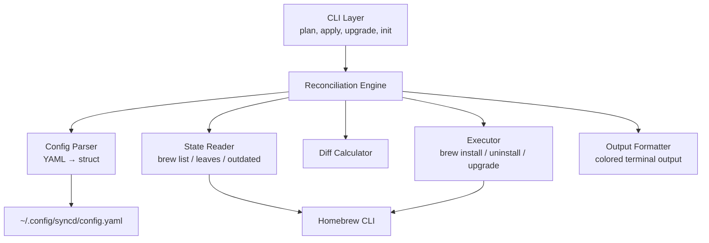
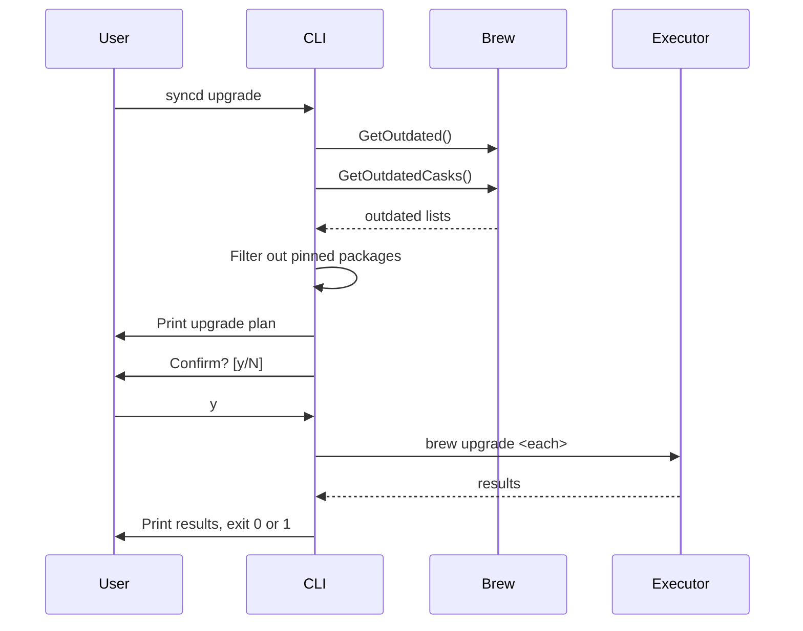
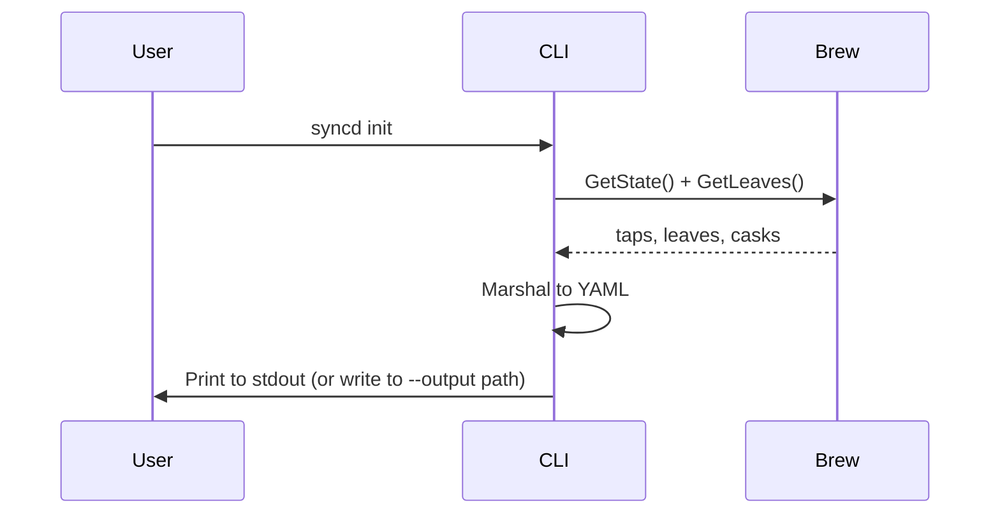

# Design: syncd v0.2 — Polish & Usability

## System Architecture

v0.2 extends the existing v0.1 architecture. No structural changes — new features are additive commands and enhancements to existing components.



### New/Modified Components

| Component | Change | Supports |
|-----------|--------|----------|
| CLI Layer | Add `upgrade` and `init` commands | REQ-033–039, REQ-043–049 |
| Config Parser | Add `pin` field | REQ-040–042 |
| State Reader | Add `GetLeaves()`, `GetOutdated()` | REQ-050–052, REQ-061–063 |
| Diff Calculator | Filter removals by leaves | REQ-050–051 |
| Executor | Add `Upgrade()` function | REQ-033–034 |
| Output Formatter | New — colored terminal output | REQ-053–056 |

### Design Decisions

1. **Extend, don't refactor** — v0.1 architecture is fit for purpose. New commands follow the same pattern (load config → query state → compute → execute).

2. **`brew leaves` for removal filtering** — Homebrew tracks which packages were explicitly requested vs auto-installed as dependencies. Using `brew leaves` means syncd only removes packages the user chose, letting `brew autoremove` handle orphaned deps. Supports REQ-050–052.

3. **Separate `upgrade` command** — Upgrading is a distinct intent from reconciliation. `apply` = "match config", `upgrade` = "bring current". Keeps `apply` idempotent and predictable. Supports US-005.

4. **Color via ANSI with TTY detection** — Use raw ANSI codes (no dependency). Detect `os.Stdout.Fd()` isatty to suppress color in pipes. Supports REQ-053–056.

5. **Pin in config, not in Homebrew** — Pin list is syncd-owned so it works regardless of backend. No `brew pin` calls. Supports REQ-040–042, future extensibility.

---

## Technical Design

### Config Changes

```go
// internal/config/config.go
type Config struct {
    Taps    []string `yaml:"taps"`
    Brews   []string `yaml:"brews"`
    Casks   []string `yaml:"casks"`
    Pin     []string `yaml:"pin"`
    Cleanup Cleanup  `yaml:"cleanup"`
}
```

The `pin` field is a flat list of package names (brews or casks). `KnownFields(true)` already validates structure.

### New State Queries

```go
// internal/brew/state.go (additions)

// GetLeaves returns explicitly-installed formulae (not auto-deps).
func GetLeaves(runner CommandRunner) ([]string, error)

// GetOutdated returns formulae with available upgrades.
func GetOutdated(runner CommandRunner) ([]string, error)

// GetOutdatedCasks returns casks with available upgrades.
func GetOutdatedCasks(runner CommandRunner) ([]string, error)
```

| Function | Command | Purpose |
|----------|---------|---------|
| `GetLeaves` | `brew leaves` | Dependency-aware removal |
| `GetOutdated` | `brew outdated --formula -1` | Upgrade planning |
| `GetOutdatedCasks` | `brew outdated --cask -1` | Upgrade planning |

### Dependency-Aware Removal

Current `plan.Compute` compares `state.Brews` (all installed) against config. Change to compare only leaves:

```go
func Compute(cfg *config.Config, state *State) *Plan {
    // ...
    if cfg.Cleanup.RemoveUnlisted {
        // Only remove leaves, not dependencies
        p.BrewsToRemove = diff(state.Leaves, dedup(cfg.Brews))
        // Casks have no dependency concept — keep as-is
        p.CasksToRemove = diff(state.Casks, dedup(cfg.Casks))
        p.TapsToRemove = diff(state.Taps, dedup(cfg.Taps))
    }
    // ...
}
```

The `State` struct gains a `Leaves` field:

```go
type State struct {
    Taps   []string
    Brews  []string
    Leaves []string  // explicitly-installed formulae only
    Casks  []string
}
```

### Upgrade Command Flow



Executor addition:

```go
// internal/brew/executor.go (addition)
func Upgrade(runner CommandRunner, brews, casks []string) []Result {
    var results []Result
    for _, name := range brews {
        _, err := runner.Run("brew", "upgrade", name)
        results = append(results, Result{Action: "upgrade", Package: name, Err: err})
    }
    for _, name := range casks {
        _, err := runner.Run("brew", "upgrade", "--cask", name)
        results = append(results, Result{Action: "upgrade-cask", Package: name, Err: err})
    }
    return results
}
```

### Init Command Flow



```go
// internal/cli/init.go
func NewInitCmd() *cobra.Command {
    var output string
    var force bool
    // ...
    // Query state, build Config struct from leaves/casks/taps, marshal to YAML
}
```

Output format matches the config schema exactly — the generated file is immediately usable with `syncd apply --config`.

### Colored Output

```go
// internal/cli/output.go
package cli

import "os"

var (
    Green  = "\033[32m"
    Red    = "\033[31m"
    Yellow = "\033[33m"
    Reset  = "\033[0m"
)

func init() {
    if !isTerminal(os.Stdout.Fd()) {
        Green, Red, Yellow, Reset = "", "", "", ""
    }
}

func isTerminal(fd uintptr) bool {
    // Use golang.org/x/term or syscall-based check
}
```

Usage in `printPlan`:
- `Green + "  + " + name + Reset` for additions
- `Red + "  - " + name + Reset` for removals
- `Yellow + "  ~ " + action + Reset` for maintenance

### Verbose Flag

Add `--verbose` as a persistent flag on root command. Pass through to executor:

```go
// When verbose, print command output in real-time
func (r *ExecRunner) RunVerbose(name string, args ...string) ([]byte, error) {
    cmd := exec.Command(name, args...)
    cmd.Stdout = os.Stdout
    cmd.Stderr = os.Stderr
    err := cmd.Run()
    return nil, err
}
```

The executor checks a verbose flag to choose between `Run` (capture) and `RunVerbose` (stream).

### Makefile Additions

```makefile
install: build
	cp bin/syncd /usr/local/bin/syncd

uninstall:
	rm -f /usr/local/bin/syncd
```

---

## Implementation Phases

### Phase 1: Dependency-Aware Removal (~1.5h)

- Add `GetLeaves()` to state reader
- Add `Leaves` field to `plan.State`
- Update `Compute()` to use leaves for brew removal
- Update CLI to pass leaves
- Tests for leaf-only removal

**Deliverable:** `remove_unlisted` no longer removes dependencies.

### Phase 2: Colored Output (~1h)

- Create `internal/cli/output.go` with color helpers + TTY detection
- Update `printPlan` and `FormatResults` to use colors
- Test: color suppressed when piped

**Deliverable:** Scannable colored output in terminal.

### Phase 3: Upgrade Command (~2h)

- Add `pin` field to Config struct
- Add `GetOutdated()` and `GetOutdatedCasks()` to state reader
- Add `Upgrade()` to executor
- Create `internal/cli/upgrade.go` command
- Wire into root command
- Tests for pin filtering, continue-on-error

**Deliverable:** `syncd upgrade` upgrades all non-pinned packages.

### Phase 4: Init Command (~1.5h)

- Create `internal/cli/init.go`
- Query leaves + casks + taps, marshal to YAML
- `--output` flag with `--force` overwrite protection
- Tests for output format, file write, overwrite guard

**Deliverable:** `syncd init` generates a working config from current state.

### Phase 5: Verbose & Install (~1h)

- Add `--verbose` persistent flag
- Implement `RunVerbose` in executor
- Add `install`/`uninstall` Makefile targets
- Verify `make install && syncd --version` works

**Deliverable:** Global install and verbose debugging.

---

## Testing Strategy

### Unit Tests

| Package | New Tests |
|---------|-----------|
| `config` | Parse `pin` field, reject invalid pin types |
| `brew` | Mock `brew leaves`, `brew outdated`, `brew outdated --cask` |
| `plan` | Leaf-only removal, pin filtering |
| `cli` | Color suppression, init YAML output |

### Integration Tests (fake brew)

| Scenario | Validates |
|----------|-----------|
| `plan` with deps installed — deps not in removal list | REQ-050–051 |
| `upgrade` skips pinned packages | REQ-042 |
| `upgrade` continues on failure | REQ-039 |
| `init` produces valid config | REQ-043 |
| `init --output` writes file, refuses overwrite | REQ-048–049 |
| Piped output has no ANSI codes | REQ-056 |

---

## Requirement-to-Design Mapping

| Requirement | Design Section |
|-------------|---------------|
| REQ-033 | Upgrade Command Flow — `brew upgrade` |
| REQ-034 | Upgrade Command Flow — `brew upgrade --cask` |
| REQ-035 | Upgrade Command Flow — pin filtering |
| REQ-036 | Upgrade Command Flow — confirmation prompt |
| REQ-037 | Upgrade Command Flow — print plan before prompt |
| REQ-038 | Upgrade Command Flow — exit codes |
| REQ-039 | Upgrade Command Flow — continue on error |
| REQ-040 | Config Changes — `pin` field |
| REQ-041 | Config Changes — `KnownFields(true)` validates |
| REQ-042 | Upgrade Command Flow — pin filtering |
| REQ-043 | Init Command Flow — marshal to YAML |
| REQ-044 | Init Command Flow — `GetLeaves()` |
| REQ-045 | Init Command Flow — casks from `GetState()` |
| REQ-046 | Init Command Flow — taps from `GetState()` |
| REQ-047 | Init Command Flow — stdout default |
| REQ-048 | Init Command Flow — `--output` flag |
| REQ-049 | Init Command Flow — `--force` overwrite |
| REQ-050 | Dependency-Aware Removal — leaves filter |
| REQ-051 | Dependency-Aware Removal — leaves filter |
| REQ-052 | New State Queries — `GetLeaves()` |
| REQ-053 | Colored Output — green prefix |
| REQ-054 | Colored Output — red prefix |
| REQ-055 | Colored Output — yellow prefix |
| REQ-056 | Colored Output — TTY detection |
| REQ-057 | Verbose Flag — `RunVerbose` |
| REQ-058 | Verbose Flag — default behavior unchanged |
| REQ-059 | Makefile Additions — `install` target |
| REQ-060 | Makefile Additions — `uninstall` target |
| REQ-061 | New State Queries — `GetLeaves()` |
| REQ-062 | New State Queries — `GetOutdated()` |
| REQ-063 | New State Queries — `GetOutdatedCasks()` |
