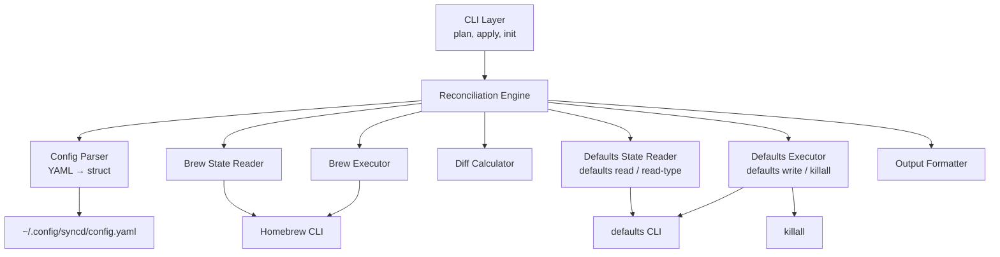
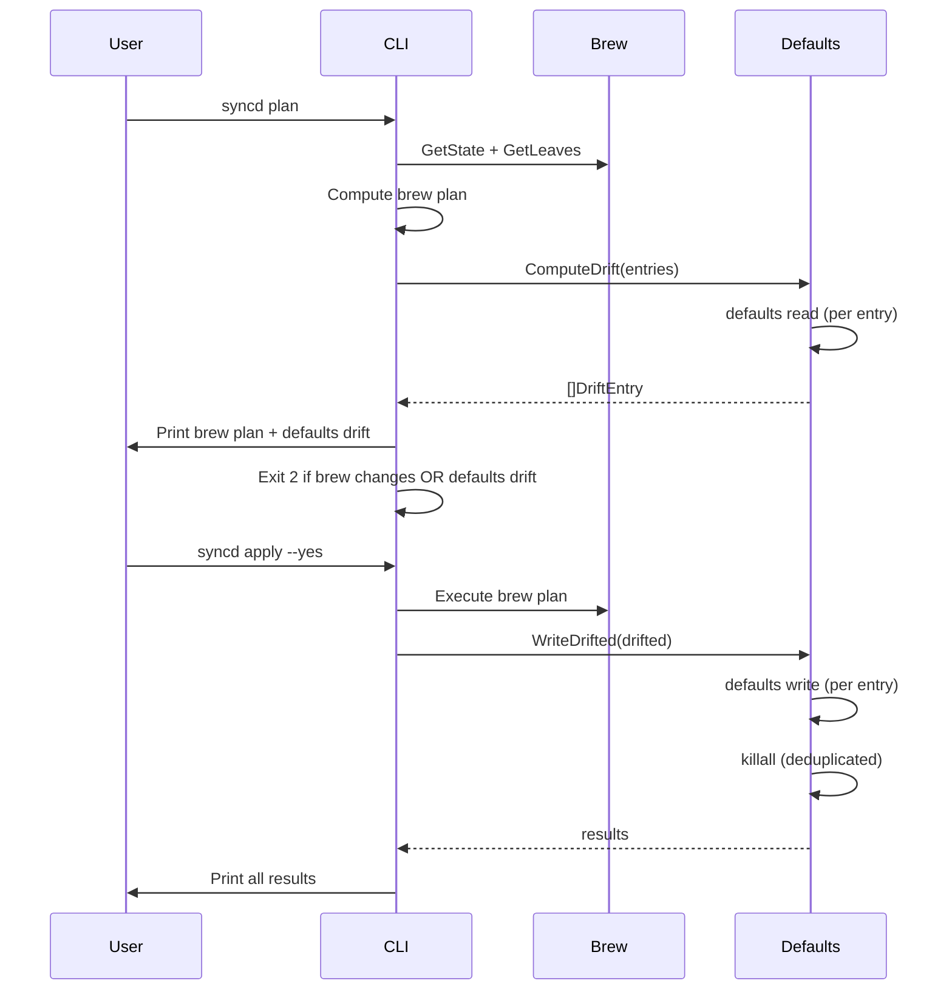

# Design: syncd v0.3 — macOS Defaults

## System Architecture

v0.3 extends the existing architecture with a new `internal/defaults` package. The reconciliation pattern is identical to Homebrew: read config → query state → compute drift → execute writes.



### New Components

| Component | Location | Purpose |
|-----------|----------|---------|
| Defaults State Reader | `internal/defaults/state.go` | Query `defaults read` and `defaults read-type` |
| Defaults Executor | `internal/defaults/executor.go` | Run `defaults write` and `killall` |
| Defaults Drift Calculator | `internal/defaults/drift.go` | Compare config entries against current state |
| Domain-to-App Map | `internal/defaults/apps.go` | Well-known domain → app name mapping for `kill` inference |

### Design Decisions

1. **New `internal/defaults` package** — Keeps macOS defaults logic separate from Homebrew logic. Both use the same `CommandRunner` interface from `internal/runner` for testability. No import cycle.

2. **Extract `CommandRunner` to `internal/runner`** — The `CommandRunner`, `MockRunner`, and `ExecRunner` types move to a shared `internal/runner` package. Both `brew` and `defaults` import it. This avoids cross-domain coupling.

3. **Drift as a separate struct from Plan** — Defaults drift is conceptually different from package changes (no install/remove, just write). A `DefaultsDrift` struct keeps the plan clean and allows independent display/execution.

4. **Type-aware comparison** — `defaults read` returns raw strings. syncd parses them according to the declared type before comparing. This avoids false drift from formatting differences (e.g., `1` vs `true` for bools).

5. **Kill deduplication at execution time** — Collect all apps to kill from drifted entries, deduplicate, then kill once after all writes complete. This minimizes app restarts.

6. **`killall` failures are non-fatal** — An app may not be running. `killall` failure is logged but doesn't mark the apply as failed.

7. **Init snapshots only specified keys** — The full defaults database is enormous. `--defaults` flag takes explicit `domain:key` pairs. This keeps init fast and output relevant.

---

## Technical Design

### Config Changes

```go
// internal/config/config.go
type Config struct {
    Taps     []string        `yaml:"taps"`
    Brews    []string        `yaml:"brews"`
    Casks    []string        `yaml:"casks"`
    Pin      []string        `yaml:"pin"`
    Defaults []DefaultEntry  `yaml:"defaults"`
    Cleanup  Cleanup         `yaml:"cleanup"`
}

type DefaultEntry struct {
    Domain string      `yaml:"domain"`
    Key    string      `yaml:"key"`
    Type   string      `yaml:"type"`
    Value  interface{} `yaml:"value"`
    Kill   []string    `yaml:"kill,omitempty"`
}
```

The `defaults` field is a list of entries. Each entry is validated:
- `domain`, `key`, `type` are required strings
- `type` must be one of: `string`, `int`, `float`, `bool`
- `value` is required and must be compatible with declared type
- `kill` is optional (list of app names)
- `KnownFields(true)` rejects unknown fields within entries

### Validation

```go
// internal/config/validate.go
func ValidateDefaults(entries []DefaultEntry) error {
    allowedTypes := map[string]bool{"string": true, "int": true, "float": true, "bool": true}
    for i, e := range entries {
        if e.Domain == "" {
            return fmt.Errorf("defaults[%d]: domain is required", i)
        }
        if e.Key == "" {
            return fmt.Errorf("defaults[%d]: key is required", i)
        }
        if !allowedTypes[e.Type] {
            return fmt.Errorf("defaults[%d]: type must be string, int, float, or bool", i)
        }
        if e.Value == nil {
            return fmt.Errorf("defaults[%d]: value is required", i)
        }
        if err := validateTypeMatch(e.Type, e.Value); err != nil {
            return fmt.Errorf("defaults[%d]: %w", i, err)
        }
    }
    return nil
}
```

`validateTypeMatch` also rejects non-scalar values (arrays, maps) that YAML may parse into `[]interface{}` or `map[string]interface{}`.
```

### Defaults State Reader

```go
// internal/defaults/state.go
package defaults

import "github.com/joedorseyjr/syncd/internal/runner"

// ReadValue reads the current value of a default. Returns ("", false, nil) if unset.
// Always uses Run (capture) — never RunMutate — because output must be parsed.
func ReadValue(r runner.CommandRunner, domain, key string) (string, bool, error)

// ReadType reads the stored type of a default. Returns ("", false, nil) if unset.
// Always uses Run (capture) for the same reason.
func ReadType(r runner.CommandRunner, domain, key string) (string, bool, error)
```

| Function | Command | Handles |
|----------|---------|---------|
| `ReadValue` | `defaults read <domain> <key>` | Exit 1 → unset |
| `ReadType` | `defaults read-type <domain> <key>` | Exit 1 → unset |

### Drift Calculator

```go
// internal/defaults/drift.go
package defaults

import "github.com/joedorseyjr/syncd/internal/config"

// DriftEntry represents a single default that differs from desired state.
type DriftEntry struct {
    Domain  string
    Key     string
    Type    string
    Current string   // "unset" if domain/key doesn't exist
    Desired string
    Kill    []string
}

// ComputeDrift compares declared defaults against current system state.
func ComputeDrift(runner brew.CommandRunner, entries []config.DefaultEntry) ([]DriftEntry, error)
```

The drift calculator:
1. For each config entry, calls `ReadValue(runner, domain, key)`
2. Parses the raw output according to declared type
3. Compares parsed current value against declared value
4. Returns only entries where values differ (or key is unset)

### Type Comparison Logic

| Config Type | `defaults read` Output | Config Value | Match? |
|-------------|----------------------|--------------|--------|
| `int` | `48` | `48` | ✓ |
| `float` | `0.5` | `0.5` | ✓ |
| `bool` | `1` | `true` | ✓ |
| `bool` | `0` | `false` | ✓ |
| `string` | `hello` | `hello` | ✓ |

```go
// internal/defaults/compare.go

// CompareValue returns true if the raw defaults output matches the config value.
func CompareValue(rawOutput string, configType string, configValue interface{}) bool
```

Bool mapping: `defaults read` returns `1`/`0`; config uses `true`/`false`. The comparison normalizes both sides.

**Bool round-trip:** Write `TRUE` → macOS stores as boolean → `defaults read` returns `1` → compare against config `true` → match. This is correct and tested.

### Defaults Executor

```go
// internal/defaults/executor.go
package defaults

import "github.com/joedorseyjr/syncd/internal/brew"

// WriteResult captures the outcome of a defaults write operation.
type WriteResult struct {
    Domain string
    Key    string
    Err    error
}

// KillResult captures the outcome of a killall operation.
type KillResult struct {
    App string
    Err error
}

// WriteDrifted writes all drifted defaults and kills affected apps.
func WriteDrifted(runner brew.CommandRunner, drifted []DriftEntry) ([]WriteResult, []KillResult)
```

Execution flow:
1. For each drifted entry: `defaults write <domain> <key> -<type> <value>`
2. Collect all `kill` apps from successfully-written entries
3. Deduplicate app names
4. For each unique app: `killall <app>` (non-fatal on error)

Type flag mapping:
| Config Type | `defaults write` Flag |
|-------------|----------------------|
| `string` | `-string` |
| `int` | `-int` |
| `float` | `-float` |
| `bool` | `-bool` |

Bool value mapping for write: config `true` → write `TRUE`, config `false` → write `FALSE`.

### Well-Known Domain Map

```go
// internal/defaults/apps.go
package defaults

// KnownApps maps preference domains to the app that must be restarted.
var KnownApps = map[string]string{
    "com.apple.dock":                "Dock",
    "com.apple.finder":              "Finder",
    "com.apple.systemuiserver":      "SystemUIServer",
    "com.apple.menuextra.clock":     "SystemUIServer",
    "com.apple.Safari":              "Safari",
    "com.apple.Terminal":            "Terminal",
    "com.apple.screencapture":       "SystemUIServer",
    "com.apple.driver.AppleBluetoothMultitouch.trackpad": "",
    "com.apple.AppleMultitouchTrackpad": "",
    "com.apple.HIToolbox":           "",
    "com.apple.desktopservices":     "Finder",
    "com.apple.ActivityMonitor":     "Activity Monitor",
    "com.apple.TextEdit":            "TextEdit",
    "NSGlobalDomain":                "",
}
```

Used by `syncd init` to infer the `kill` field when snapshotting defaults.

### CLI Changes

#### Plan Command

Update `NewPlanCmd` to also compute defaults drift:

```go
// After computing brew plan...
if len(cfg.Defaults) > 0 {
    drifted, err := defaults.ComputeDrift(runner, cfg.Defaults)
    // Print drift, factor into exit code
}
```

Output format for defaults drift:
```
Defaults drift:
  ~ com.apple.dock tilesize: 64 → 48
  ~ com.apple.dock autohide: 0 → true
  + NSGlobalDomain KeyRepeat: unset → 2
```

- `~` (yellow) for value change
- `+` (green) for unset → desired

#### Apply Command

Update `NewApplyCmd` to write drifted defaults after brew execution:

```go
// After brew execution...
if len(cfg.Defaults) > 0 {
    drifted, _ := defaults.ComputeDrift(runner, cfg.Defaults)
    if len(drifted) > 0 {
        writeResults, killResults := defaults.WriteDrifted(runner, drifted)
        // Print results, check for errors
    }
}
```

#### Init Command

Add `--defaults` flag:

```go
// internal/cli/init.go (addition)
var defaultsFlag string
cmd.Flags().StringVar(&defaultsFlag, "defaults", "", "comma-separated domain:key pairs to snapshot")
```

When `--defaults` is provided:
1. Parse comma-separated `domain:key` pairs (split each pair on first `:` only)
2. For each pair, call `ReadType` and `ReadValue`
3. Skip entries that can't be read (print warning)
4. Look up domain in `KnownApps` for `kill` inference
5. Add entries to the generated config

### Integration with Existing Commands

The key principle: defaults operations run **after** brew operations in both plan and apply. This keeps the existing brew flow untouched and adds defaults as an additive layer.



### HasChanges Update

The `plan.Plan` struct doesn't change. Instead, the CLI layer checks both:

```go
hasChanges := p.HasChanges() || len(drifted) > 0
```

This keeps the plan package focused on brew and avoids coupling it to defaults.

---

## Implementation Phases

### Phase 1: Config Schema & Validation (~1.5h)

- Add `DefaultEntry` struct and `Defaults` field to Config
- Implement `ValidateDefaults()` with type checking
- Unit tests for parsing, validation, type mismatch rejection
- Verify existing configs without `defaults` still parse correctly

**Deliverable:** Config accepts and validates `defaults` section.

### Phase 2: Defaults State Reader (~1.5h)

- Create `internal/defaults/` package
- Implement `ReadValue()` and `ReadType()`
- Implement `CompareValue()` with type-aware comparison
- Implement `ComputeDrift()`
- Unit tests with MockRunner for all type scenarios

**Deliverable:** Can detect drift between config and system state.

### Phase 3: Plan Integration (~1h)

- Update `NewPlanCmd` to compute and display defaults drift
- Update exit code logic (drift = exit 2)
- Colored output for defaults drift (yellow `~`, green `+`)
- Integration tests with fake `defaults` script

**Deliverable:** `syncd plan` shows defaults drift.

### Phase 4: Defaults Executor & Apply (~2h)

- Implement `WriteDrifted()` with type flag mapping
- Implement kill deduplication and execution
- Update `NewApplyCmd` to write defaults after brew
- Include defaults drift in confirmation prompt
- Continue-on-error, result reporting
- Integration tests for write, kill, error handling

**Deliverable:** `syncd apply` writes defaults and restarts apps.

### Phase 5: Init Snapshot (~1.5h)

- Add `--defaults` flag to init command
- Implement domain:key parsing and snapshot logic
- Add `KnownApps` map for kill inference
- Handle unreadable defaults (warning + skip)
- Integration tests for snapshot output

**Deliverable:** `syncd init --defaults` snapshots preferences into config.

---

## Testing Strategy

### Unit Tests

| Package | New Tests |
|---------|-----------|
| `config` | Parse `defaults` section, validate types, reject invalid entries, reject unknown fields |
| `defaults` | Mock `defaults read`/`read-type`, type comparison, drift calculation, write command construction, kill deduplication |

### Integration Tests (fake defaults script)

| Scenario | Validates |
|----------|-----------|
| `plan` shows drift for changed value | REQ-075 |
| `plan` shows "unset" for missing key | REQ-076 |
| `plan` hides matching values | REQ-077 |
| `plan` exit 2 with only defaults drift | REQ-079 |
| `plan` is read-only (no writes) | REQ-080 |
| `apply` writes drifted defaults | REQ-081 |
| `apply` kills affected apps | REQ-083 |
| `apply` deduplicates kills | REQ-084 |
| `apply` continues on write failure | REQ-086 |
| `apply` idempotent (second run = no drift) | REQ-090 |
| `init --defaults` snapshots values | REQ-091 |
| `init --defaults` infers kill for known domains | REQ-094 |
| `init --defaults` skips unreadable with warning | REQ-096 |
| `init --defaults` combined with brew snapshot | REQ-097 |

### Fake Defaults Script

Extend the integration test infrastructure with a fake `defaults` script that:
- Stores values in `$FAKE_DEFAULTS_STATE` directory
- Supports `read`, `read-type`, `write` subcommands
- Returns exit 1 for missing domain/key pairs

---

## Requirement-to-Design Mapping

| Requirement | Design Section |
|-------------|---------------|
| REQ-067 | Config Changes — `Defaults` field |
| REQ-068 | Config Changes — `DefaultEntry.Domain` |
| REQ-069 | Config Changes — `DefaultEntry.Key` |
| REQ-070 | Validation — `allowedTypes` |
| REQ-071 | Validation — `validateTypeMatch` |
| REQ-072 | Config Changes — `DefaultEntry.Kill` |
| REQ-073 | Config Changes — `KnownFields(true)` |
| REQ-074 | Defaults State Reader — `ReadValue` |
| REQ-075 | Drift Calculator — `ComputeDrift` |
| REQ-076 | Drift Calculator — unset handling |
| REQ-077 | Drift Calculator — match = no drift |
| REQ-078 | CLI Changes — Plan output format |
| REQ-079 | CLI Changes — `hasChanges` includes drift |
| REQ-080 | CLI Changes — plan is read-only |
| REQ-081 | Defaults Executor — `WriteDrifted` |
| REQ-082 | Defaults Executor — type flag mapping |
| REQ-083 | Defaults Executor — kill after write |
| REQ-084 | Defaults Executor — kill deduplication |
| REQ-085 | Defaults Executor — no kill when no drift |
| REQ-086 | Defaults Executor — continue on error |
| REQ-087 | Defaults Executor — `WriteResult.Err` |
| REQ-088 | CLI Changes — exit 1 on failure |
| REQ-089 | CLI Changes — Apply confirmation includes drift |
| REQ-090 | Defaults Executor — idempotent writes |
| REQ-091 | CLI Changes — Init `--defaults` flag |
| REQ-092 | Defaults State Reader — `ReadType` + `ReadValue` |
| REQ-093 | CLI Changes — Init YAML output |
| REQ-094 | Well-Known Domain Map — `KnownApps` |
| REQ-095 | Well-Known Domain Map — omit unknown |
| REQ-096 | CLI Changes — Init skip + warning |
| REQ-097 | CLI Changes — Init combined output |
| REQ-098 | Defaults State Reader — `ReadType` |
| REQ-099 | Type Comparison Logic — `CompareValue` |
| REQ-100 | Type Comparison Logic — bool mapping |
| REQ-101 | Defaults State Reader — `ReadValue` |
| REQ-102 | Defaults State Reader — `ReadType` |
| REQ-103 | Defaults State Reader — exit 1 = unset |
| REQ-104 | Defaults Executor — write command |
| REQ-105 | Defaults Executor — killall command |
| REQ-106 | Defaults Executor — killall non-fatal |
| REQ-107 | CLI Changes — verbose output |
